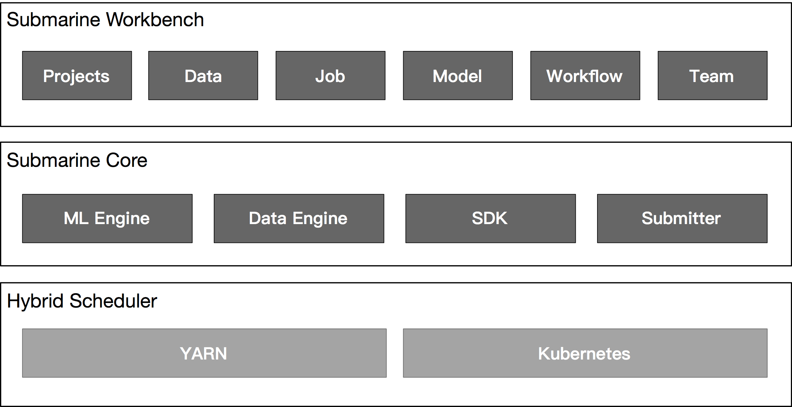

<!---
  Licensed under the Apache License, Version 2.0 (the "License");
  you may not use this file except in compliance with the License.
  You may obtain a copy of the License at

   http://www.apache.org/licenses/LICENSE-2.0

  Unless required by applicable law or agreed to in writing, software
  distributed under the License is distributed on an "AS IS" BASIS,
  WITHOUT WARRANTIES OR CONDITIONS OF ANY KIND, either express or implied.
  See the License for the specific language governing permissions and
  limitations under the License. See accompanying LICENSE file.
-->

# Why does this fork exist?

The hadoop submarine repository is a temporary development repository forked from the [hadoop/hadoop-submarine](https://github.com/apache/hadoop/tree/trunk/hadoop-submarine).

The creation of this temporary is mainly because more and more people from different companies and organizations want to work together to participate in the development of the hadoop submarine project, but the hadoop submarine committers are difficult to quickly complete the review work of the newly submitted PR. In order to speed up the development speed of the project, this temporary repository, allows the hadoop submarine developers to review the code here.

If all goes well, this should be a short-lived fork rather than a long-lived one.

# What is Hadoop Submarine?

Submarine is a new subproject of Apache Hadoop.

Submarine is a project which allows infra engineer / data scientist to run
*unmodified* TensorFlow or PyTorch programs on YARN or Kubernetes.

Goals of Submarine:
- It allows jobs easy access data/models in HDFS and other storages.
- Can launch services to serve TensorFlow/PyTorch models.
- Support run distributed TensorFlow jobs with simple configs.
- Support run user-specified Docker images.
- Support specify GPU and other resources.
- Support launch TensorBoard for training jobs if user specified.
- Support customized DNS name for roles (like TensorBoard.$user.$domain:6006)

# Architecture

### Submarine Workbench

Submarine Workbench is a WEB system. Algorithm engineers can perform complete lifecycle management of machine learning jobs in the Workbench.

+ **Projects**

  Manage machine learning jobs through project.

+ **Data**

  Data processing, data conversion, feature engineering, etc. in the workbench.

+ **Job**

  Data processing, algorithm development, and model training in machine learning jobs as a job run.

+ **Model**

  Algorithm selection, parameter adjustment, model training, model release, model Serving.

+ **Workflow**

  Automate the complete life cycle of machine learning operations by scheduling workflows for data processing, model training, and model publishing.

+ **Team**

  Support team development, code sharing, comments, code and model version management.

### Submarine Core

The submarine core is the execution engine of the system and has the following features：

- **ML Engine**

  Support for multiple machine learning framework access, such as tensorflow, pytorch.

- **Data Engine**

  Docking the externally deployed Spark calculation engine for data processing.

- **SDK**

  Support Python, Scala, R language for algorithm development, The SDK is provided to help developers use submarine's internal data caching, data exchange, and task tracking to more efficiently improve the development and execution of machine learning tasks.

- **Submitter**

  Compatible with the underlying hybrid scheduling system of yarn and k8s for unified task scheduling and resource management, so that users are not aware.

+ **Hybrid Scheduler**
  + **YARN**
  + **Kubernetes**

## Quick start

### Run mini-submarine in one step

You can use [mini-submarine](./dev-support/mini-submarine/README.md) for a quick experience submairne.

This is a docker image built for submarine development and quick start test.

### Installation and deployment

Read the [Quick Start Guide](./docs/helper/QuickStart.md), 

